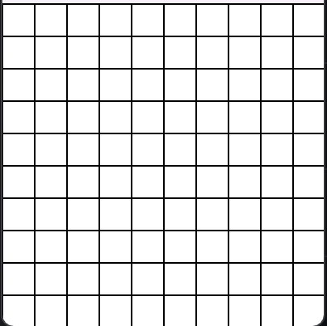
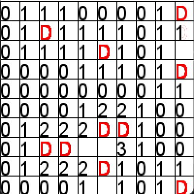

# Démineur

## Objectif
Le but du démineur est de découvrir toutes les cases libres sur une grille sans cliquer sur une mine.

## Règles
1. Le jeu se déroule sur une grille carrée composée de cases.
   
2. Certaines cases cachent des mines, et l'objectif est de découvrir toutes les cases sans mines.
3. Chaque case contenir un nombre indiquant le nombre de mines adjacentes, ou contenir une mine.
4. Le jeu commence avec toutes les cases cachées.
5. Le joueur peut révéler une case en la cliquant(clique gauche). Quand la case se dévoile, si elle contient un nombre, ce nombre indique le nombre de mines adjacentes.
6. Si le joueur clique sur une mine, le jeu se termine. Sinon, le jeu continue.
7. Si le joueur pense qu'une case contient une mine, il peut la marquer avec un drapeau (en cliquant avec le bouton droit de la souris).
   
8. Le jeu est gagné lorsque toutes les cases sans mines sont découvertes.

## Commande
1. Clique grauche: Dévoiler une case.
2. Clique droite: Poser un drapeau.
3. Touche espace: Losque la partie est terminé presser la touche espace recommence une partie

## Mode d'emploi
De base lorsque que la class play est executé, un démineur de dimention 10x10 est créer avec 10 bombes en mode graphique. Pour changer la dimention de la grille, il suffit de modifier la valeur en paramètre lors de l'instanciation du démineur. Pour changer le nombe de mine il faut changer la valeur en paramètre de la fonction startGameWindow().

## Fonctionnement du projet
Il y a deux classe une qui va représenter chaques cases du démineur(Cell) et une autre qui va gérer les démineurs(Demineur)

### Classe Cell
La classe Cell permet de stocker les nombres de chaque cases, si la case est une bombe, s'il y a un drapeau au-dessus et si elle est caché ou non. 

### Classe Demineur
La classe Demineur est séparé en trois parties:
1. Les fonctions pour le mode graphique
2. Les fonctions pour le mode ligne de commandes
3. Les fonctions utilisées dans les deux modes

#### Mode Graphique
1. On commence par générer la grille avec la génération de bombes et le calcule des nombres de chaque case comme pour le mode ligne de commande 
2. Puis on génère la fenêtre avec la grille et les events listener au fonctionnement du jeu
3. Lors du clique gauche d'un joueur. On contrôle si la case cliqué est déjà découverte ou s'il y a un drapeau, si non on peut la découvrir et decouvrir les cases adjacentes si le numéro de la case est 0. On répète cela pour toutes les cases découvertes lors du tour.
4. Si le joueur clique sur une bombe alors la partie est terminé et un message apparait pour demander si l'utilisateur veut rejouer.
5. Si non la partie continue jusqu'à que toutes les cases non bombes ont été découvertes. Si cela se produit alors un message apparait pour demander au joueur s'il veut rejouer.

#### Mode Ligne de Commande
1. On commence par générer la grille avec la génération de bombes et le calcule des nombres de chaque case comme pour le mode Graphique
2. Puis la partie peut commencé, le joueur est invité à entrer les coordées d'une case et l'action qu'il souhaite faire. Les questions sont reposées jusqu'à que l'utilisateur entre des coordonnées valides et une action valide.
3. Quand le movement est pris en compte. Alors, on peut executer l'action.
4. Si l'action fait que le joueur découvre une bombe. Alors, un message de défaite apparait, et le programme s'arrête.
5. Si non le programe continue jusqu'à que l'utilisateur découvre toutes les cases. Quand c'est le cas un message de victoire apparait et le programme s'arrête.
6. À chaque tour la grille mise à jour est print sur la console. 